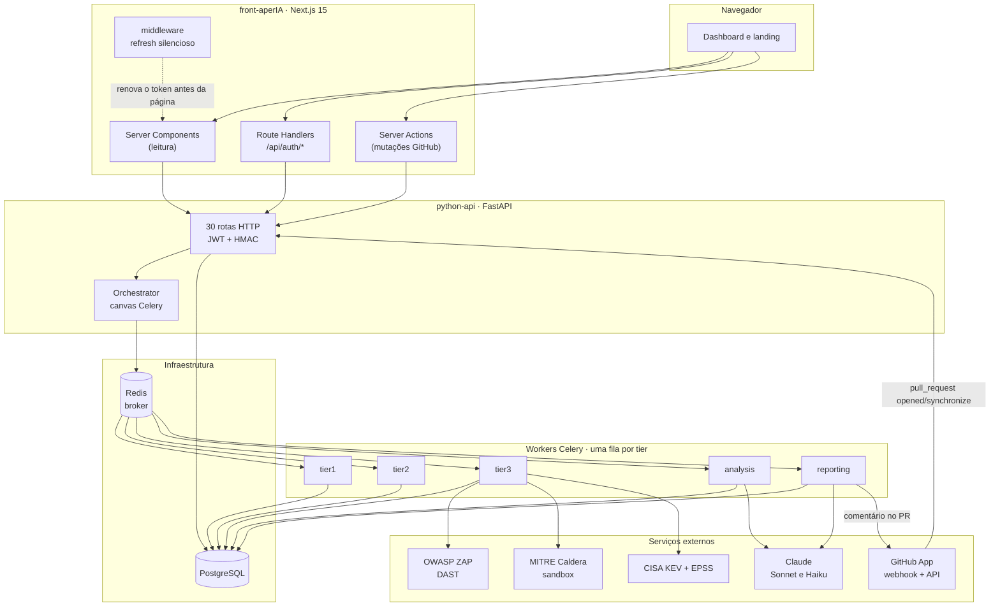

# aperIA — dossiê técnico

**Documento de avaliação · FIAP** · Arquitetura e pipeline de análise.

Este documento é **explicação** no sentido do [Diátaxis](https://diataxis.fr/):
discute como o sistema é construído e por que as decisões foram tomadas assim.
Ele é autocontido — não pressupõe a apresentação oral nem a leitura dos outros
documentos. Para executar o projeto, o tutorial e os how-tos estão mapeados no
[apêndice C](#c-mapa-da-documentação).

Onde este texto e os documentos mais antigos discordarem, **este está certo**:
os fatos abaixo foram conferidos contra o código, e o [§8.5](#85-a-documentação-ficou-atrás-do-código)
lista as divergências que encontramos ao escrevê-lo.

---

## Sumário

1. [O problema e a proposta](#1-o-problema-e-a-proposta)
2. [Arquitetura em uma página](#2-arquitetura-em-uma-página)
3. [O front-end](#3-o-front-end)
4. [O back-end](#4-o-back-end)
5. [O pipeline de 3 tiers](#5-o-pipeline-de-3-tiers)
6. [Como o resultado chega na tela](#6-como-o-resultado-chega-na-tela)
7. [Decisões de engenharia](#7-decisões-de-engenharia)
8. [Limites assumidos](#8-limites-assumidos)
9. [Apêndices](#9-apêndices)

---

## 1. O problema e a proposta

Um scanner de segurança devolve uma lista. O problema de quem recebe essa lista
não é falta de informação — é excesso sem hierarquia.

Dois números medidos no nosso próprio ambiente de teste, com o
[OWASP Juice Shop](https://owasp.org/www-project-juice-shop/) como alvo:

- Um scan de Tier 1 e 2 produziu **57 findings**, dos quais cerca de **49 eram o
  mesmo problema** repetido em arquivos diferentes.
- Com DAST ligado, um único commit gera da ordem de **12 mil findings** que
  correspondem a mais ou menos **14 problemas reais**, multiplicados pelas rotas
  da aplicação. "Cross-Domain Misconfiguration" sozinha aparece 3007 vezes, uma
  por URL.

Uma lista assim não é acionável. Pior: ela é ativamente enganosa, porque o volume
sugere gravidade onde há só repetição, e o item importante afunda no meio.

O aperIA é um **ASPM** (Application Security Posture Management) que ataca isso
por três frentes:

**Escalonar o custo.** Nem todo commit merece uma análise de uma hora. O pipeline
roda em três camadas, da mais barata para a mais cara, e só sobe quando o sinal
justifica.

**Correlacionar em vez de listar.** Findings isolados viram passos de uma cadeia
de ataque. O Claude recebe o conjunto agregado e monta a sequência: por onde se
entra, o que se alcança, qual técnica MITRE cada passo usa.

**Testar em vez de inferir.** Análise estática diz "esse padrão costuma ser
vulnerável". O Tier 3 dispara requisições reais contra a aplicação publicada
(ZAP) e emula as técnicas dentro de um sandbox isolado (MITRE Caldera) para medir
se o ataque de fato funciona naquele ambiente. A diferença entre "teoricamente
vulnerável" e "comprovadamente explorável aqui" é o produto.

Uma premissa atravessa o resto do documento: **o aperIA nunca aplica código
sozinho**. Toda remediação é proposta para aprovação humana. Isso é decisão de
produto, não limitação técnica.

---

## 2. Arquitetura em uma página

O projeto vive em **dois repositórios**, com uma fronteira que não é acidental:
o front-end nunca fala com o banco, e a API nunca renderiza tela.

| Repositório | Responsabilidade | Stack |
|---|---|---|
| `front-aperIA` | Landing, autenticação e o dashboard. Renderização no servidor, sessão em cookie, tradução do dado da API para a tela. | Next.js 15 (App Router), React 19, TypeScript strict, Tailwind CSS v4 |
| `python-api` | Ingestão de eventos do GitHub, orquestração do pipeline, execução dos scanners, chamadas ao Claude, persistência. | FastAPI, Celery, PostgreSQL, Redis |



### Os containers

A stack é montada em camadas de `docker-compose`, para que a base suba sem
depender do que é caro.

| Arquivo | Serviços | Quando |
|---|---|---|
| `docker-compose.base.yml` | `api`, `worker_tier1`, `worker_tier2`, `worker_tier3`, `worker_analysis`, `worker_reporting`, `db`, `redis` | sempre |
| `docker-compose.scanners.yml` | `zap`, `caldera`, `caldera-agent` | Tier 3 |
| `docker-compose.observability.yml` | `prometheus`, `grafana` | opcional |
| `docker-compose.targets.yml` | `juice-shop` | alvo de teste local |

Cinco workers, um por fila. O motivo de não ser um worker só está no
[§5.3](#53-uma-fila-por-tier).

---

## 3. O front-end

Doze rotas: a landing, `/cadastro`, `/login` e dez telas de dashboard sob
`/dash`. Componentes são **Server Components por padrão**; `'use client'`
aparece só onde existe estado, efeito ou handler de verdade.

### 3.1 Por que existe um BFF só para autenticação

As telas não chamam a API Python diretamente. Elas chamam quatro Route Handlers
do Next (`/api/auth/signup`, `login`, `refresh`, `logout`), que chamam a API do
lado do servidor. Duas razões, ambas estruturais:

**A API não registra `CORSMiddleware`.** Uma chamada do navegador em `:3000`
para `:8000` seria bloqueada pelo próprio browser.

**`POST /auth/login` devolve os tokens no corpo da resposta.** O BFF converte
esses tokens em cookies `httpOnly` (`aperia_access` e `aperia_refresh`). Um XSS
no dashboard não consegue lê-los, coisa que `localStorage` não garantiria.

Os nomes dos campos divergem de propósito entre as duas pontas — o formulário é
`nome`/`senha`, o schema Pydantic é `username`/`password`/`email` — e o BFF
traduz. O `UserCreate` da API usa `extra="forbid"`, então qualquer chave a mais
devolve 422.

Para o GitHub a decisão é a oposta e pelo mesmo raciocínio: **leituras em Server
Components, mutações em Server Actions, sem rota `/api/github/*`**. As duas
razões que justificam o BFF de auth não se aplicam ali (a chamada já é
server-side, e não há cookie novo para escrever), então um route handler seria
só um salto HTTP a mais.

### 3.2 O refresh silencioso, e o bug que ele corrige

O access token vive 15 minutos; o refresh, 7 dias. O `src/middleware.ts`
(matcher `/dash/:path*`) troca o refresh por um par novo **antes da página
renderizar**, quando o access está expirado ou a menos de 60 segundos de
expirar.

O ponto não óbvio: ele decide **lendo o `exp` do JWT**, não verificando se o
cookie existe. A distinção foi um bug real. O `Max-Age` do cookie e o `exp` do
token são ambos de 15 minutos, mas o cookie é gravado alguns segundos *depois*
do token ser emitido (latência da API, pior sob carga). Nessa janela o navegador
ainda mandava o cookie, a versão antiga do middleware concluía "cookie presente,
sessão válida", e o Server Component batia na API com um JWT morto: 401, e o
dashboard renderizava deslogado no meio da sessão.

Duas sutilezas que sustentam o mecanismo:

O token novo é escrito em **`request.cookies` e `response.cookies`**. O primeiro
faz o Server Component *desta mesma requisição* já ler o token fresco; o segundo
faz o navegador guardá-lo. Sem o primeiro, a primeira carga depois da expiração
ainda falharia.

**Só um `401` limpa os cookies.** O middleware distingue três desfechos:
`renewed` (200 com par válido), `rejected` (401, o token foi definitivamente
recusado, limpa tudo) e `unavailable` (5xx, timeout, rede, corpo ilegível:
segue sem sessão mas **preserva** os cookies). Tratar qualquer não-200 como
logout transformava um soluço de servidor em deslogamento.

Há uma corrida associada, resolvida do lado da API. A tela de Scans chama
`router.refresh()` a cada 5 segundos enquanto um scan roda, então na hora em que
o access expira existe um punhado de requisições concorrentes carregando o mesmo
refresh token. Como a API rotaciona no refresh, só uma poderia ganhar e as
outras tomavam 401. A correção é uma **janela de tolerância de 30 segundos**
(`REFRESH_ROTATION_GRACE_SECONDS`): um token recém-rotacionado reapresentado
dentro dela é tratado como replay concorrente benigno e recebe outro par. Reuso
genuíno, fora da janela, continua invalidando a família inteira.

### 3.3 A URL é o estado

A tela de Findings guarda todos os filtros na query string (`repo`, `cat`,
`sev`, `scanner`, `tier`, `aging`, `q`, `de`, `ate`, `vis`, `titulo`). Não há
estado de filtro em memória para divergir da barra de endereços. Filtro
compartilhável e botão "voltar" funcionando saem de graça.

Um detalhe que já custou uma tela vazia: o dataset do protótipo tem relógio
congelado em 2024-06-29, e dado real não tem. Toda função sensível a tempo
(`timeAgo`, `defaultFrom`, `agingBucketOf`, `parseFilters`, `periodPreset`)
recebe o `now` como parâmetro, calculado no **Server Component**. Chamar
`Date.now()` no cliente divergiria do HTML do servidor; e esquecer de passá-lo
fazia a janela padrão de 90 dias filtrar todo finding real, deixando a tela
vazia sem erro nenhum.

---

## 4. O back-end

FastAPI organizado em quatro camadas, com a dependência apontando sempre para
dentro:

| Camada | Contém |
|---|---|
| `app/domain` | Entidades (`Finding`, `ScanJob`, `Repository`, `GithubAccount`), serviços de domínio e o catálogo de ferramentas. Sem I/O. |
| `app/application` | Casos de uso: disparar scan, recuperar scans travados, sugerir patch. |
| `app/infrastructure` | Scanners, cliente do Claude, cliente de Threat Intel, Git, persistência SQLAlchemy, segurança. |
| `app/presentation` | Rotas HTTP, schemas de entrada e saída, e os workers Celery. |

**30 rotas HTTP** em 8 tags. As rotas de usuário exigem `Authorization: Bearer
<access_token>`; o webhook usa esquema próprio, HMAC `X-Hub-Signature-256` com
o segredo `GITHUB_WEBHOOK_SECRET`, e não JWT. `openapi.yaml` é gerado do código
por `scripts/export_openapi.py`, e há Swagger em `/docs`.

Três decisões de modelagem que aparecem no comportamento da tela:

**`POST /repositories` é upsert por `(user_id, github_repo_id)`.** Reativar um
repositório devolve a linha existente. O front nunca confia no `id` que essa
rota devolve para depois fazer `PATCH`/`DELETE`: ids de escrita sempre vêm de um
`GET /repositories`.

**A identidade de um relatório é o `id` da execução, não o commit.** Reescanear
a mesma branch empilha uma execução nova em vez de sobrescrever a anterior, e a
URL do relatório é `/dash/relatorios/<uuid>`.

**`created_at` de um `ScanJob` não é quando o scan rodou.** Reescanear reaproveita
a linha e preserva o `created_at`, que marca quando o commit entrou no sistema.
Toda tela mostra `started_at ?? created_at`, e `GET /scans` ordena por
`COALESCE(tier1_started_at, created_at) desc`. Sem isso, um commit antigo
reescaneado agora aparecia como "há 10h" e afundava na paginação.

---

## 5. O pipeline de 3 tiers

O núcleo do produto.

### 5.1 Barato → caro, e só escala se precisar

As ferramentas orquestradas têm perfis de custo muito diferentes. TruffleHog e
Semgrep sobre o diff terminam em segundos. Trivy e Semgrep sobre o repositório
inteiro levam minutos. ZAP fazendo active scan e Caldera emulando técnicas MITRE
levam de 30 a 60 minutos.

Se todo PR disparasse tudo, todo PR pagaria o pior caso — inclusive o PR cujo
único problema já foi identificado nos primeiros segundos. Daí a regra: **cada
tier só roda se o anterior deu motivo.**

### 5.2 O canvas e as bridges

O pipeline inteiro é uma única `celery.chain`, montada em
`app/core/orchestrator.py:build_pipeline_canvas`.

Existem **dois gatilhos** para essa mesma chain — o webhook de PR
(`POST /webhook/github`, eventos `opened` e `synchronize`) e o scan manual
(`POST /repositories/{id}/scan`) — mas **um único ponto de disparo**:
`dispatch_pipeline`. Os dois caminhos passam por ele, o que impede que
divirjam. A única diferença real é o `pr_number`, que no scan manual é `None`;
isso não muda os tiers nem os gates, muda só o canal de entrega. Sem PR não há
onde comentar, então os workers de reporting pulam o post. O status check no
commit continua sendo criado, porque ele se prende ao SHA e não ao PR: "analisar"
e "avisar no GitHub" são responsabilidades separadas.

A ordem do canvas, com a fila de cada elo entre colchetes:

```
group(run_trufflehog, run_semgrep_changed)          [tier1]
  → gate1_check                                      [analysis]   Gate 1
  → _t1_to_t2_scan_bridge → run_tier2_scan           [tier2]
  → _bridge_t1_findings_into_analyze → tier2_analyze [analysis]   Claude Sonnet
  → post_tier2_report                                [reporting]  Claude Haiku
  → tier3_gate                                       [analysis]   Gate 2
  → _prepare_tier3_payload → run_tier3_scan          [tier3]      ZAP + CTI + Caldera
  → _deep_analysis_bridge → tier3_deep_analysis      [analysis]   Claude Sonnet
  → post_tier3_deep_report                           [reporting]  Claude Haiku
```

O `group` inicial é o único paralelismo real do canvas: TruffleHog e Semgrep
changed não dependem um do outro. Do Tier 2 em diante é sequencial.

**As bridges** (`_t1_to_t2_scan_bridge`, `_bridge_t1_findings_into_analyze`,
`_prepare_tier3_payload`, `_deep_analysis_bridge`) existem por uma limitação
concreta do Celery: a chain passa o resultado de uma task como **primeiro
argumento posicional** da próxima. Isso funciona enquanto cada task precisa
exatamente do output do vizinho. Quebra quando uma task precisa de mais de uma
coisa — `tier2_analyze` precisa dos findings de T1 *e* T2; `tier3_deep_analysis`
precisa do scan de Tier 3 posicionalmente *e* do resultado de `tier2_analyze`
como kwarg. As bridges são cola estrutural: combinam o resultado anterior com o
estado fixo que precisa atravessar a chain, e chamam a próxima task com os
argumentos remontados. Nenhuma tem lógica de negócio.

O segundo motivo delas existirem é mais interessante: **elas propagam a
interrupção dos gates**. Quando um gate decide parar, ele levanta
`celery.exceptions.Ignore()`. Esse `Ignore()` não interrompe automaticamente os
elos seguintes — eles continuam sendo chamados, recebendo `None` no lugar do
dict esperado. Por isso toda bridge começa com a mesma defesa
(`if not <input> or not isinstance(<input>, dict): return None`), e o `None` se
propaga bridge após bridge sem efeito colateral nenhum: nenhum scanner roda,
nenhuma chamada ao Claude sai, nenhum post no PR acontece. É assim que "o gate
bloqueou" vira "o resto da chain não faz nada", sem que cada worker downstream
precise saber que houve um gate antes dele.

### 5.3 Uma fila por tier

Cinco filas: `tier1`, `tier2`, `tier3`, `analysis` e `reporting`. Cada uma
escala sozinha. O Tier 1 roda com concorrência alta, porque é leve e o PR quer
resposta em minutos. O Tier 3 roda com concorrência baixa, porque ZAP e Caldera
são pesados e o SLA é de dezenas de minutos.

Com fila única, um PR pesado enfileirado atrás de uma rajada de PRs triviais
atrasaria justamente o feedback rápido que o Tier 1 promete. Separar também isola
falha de infraestrutura: um worker de Tier 3 caído não impede o Tier 1 e o Tier 2
de responderem.

### 5.4 O que cada tier faz

**Tier 1 — TruffleHog e Semgrep changed.** Responde rápido a duas classes de
problema com urgências diferentes.

O TruffleHog varre o que mudou entre `base_sha` e `head_sha` procurando
segredos, e tenta **verificar** cada um contra o provedor. A política de
verificação é a parte que mais confunde, e mudou: **segredos não verificados são
reportados**. Antes existia um filtro duplo (`--only-verified` na CLI mais um
segundo teste no parsing) e um segredo que o TruffleHog não conseguisse validar
sumia sem deixar rastro, o que escondia credencial revogada, de ambiente de
teste, ou de provedor sem verificador disponível.

Hoje a verificação vira **severidade, não censura**: verificado é `CRITICAL`,
não verificado é `MEDIUM`. O `MEDIUM` é deliberado — não escala para o Tier 3
(que exige `high` ou `critical`) e não bloqueia o PR (o Gate 1 só bloqueia com
`secret_verified=True`). O achado fica visível sem travar merge por suspeita.

O Semgrep changed faz SAST restrito aos arquivos alterados. Ele não bloqueia
sozinho, porque vulnerabilidade de código não é binária do jeito que um segredo
válido é. Contribui `severity`, `cwe_id` e a regra disparada como evidência para
o Gate 2 e para o raciocínio do Claude.

**Tier 2 — Trivy, Semgrep expanded, Prowler, dedup e Claude Sonnet.** Aqui o
pipeline deixa de olhar só o diff e passa a olhar o projeto inteiro.

O Trivy roda `trivy fs`, procurando CVEs conhecidas em dependências e em
arquivos de infraestrutura. O Semgrep expanded aplica a mesma regra de
security-audit sobre todo o repositório. O Prowler entra condicionalmente, só
quando o PR mexe em infraestrutura como código, procurando misconfiguração de
nuvem.

Ampliar o escopo aqui e não no Tier 1 é de novo custo: varrer o repositório
inteiro em todo PR estouraria o SLA de poucos minutos que o Tier 1 promete. Uma
vez filtrado o caso trivial, vale investir mais tempo.

A dedup existe porque os mesmos findings se repetem entre execuções e entre
scanners, e deliberadamente **não** funde CVEs iguais vindos de fontes
diferentes: o `source` faz parte da chave, porque "o Trivy e o Semgrep acharam"
é informação diferente de "um deles achou".

O Claude Sonnet então recebe o conjunto agregado com o prompt `chain_of_events`,
e tenta montar uma cadeia: cada finding como possível passo de uma sequência,
com técnica MITRE por passo, devolvendo o primeiro `risk_score`.

O `cve_id` que o Trivy encontra é a ponte para o Tier 3 — é ele que a etapa
seguinte consulta no KEV e no EPSS.

**Tier 3 — ZAP, Threat Intel e Caldera, seguidos de Claude Sonnet.** Existe
porque tudo até aqui foi análise estática: nada foi de fato testado em execução.

O **ZAP** ataca o `target_url` real da aplicação (DAST). É a evidência mais forte
de exploitabilidade, porque uma vulnerabilidade confirmada por scan ativo pesa
mais que uma inferida por padrão de código. É também onde o custo muda de
natureza: nos dois primeiros tiers o custo é função do *diff*; aqui é função da
*aplicação inteira*, e cresce como `rotas × parâmetros × regras de ataque`, um
número que nada no PR limita. Daí os tetos configuráveis de duração de spider,
de active scan e por regra.

O **Threat Intel** responde a uma pergunta que nenhum scanner estático responde:
"esse CVE está sendo explorado por atacantes de verdade, hoje?". A fonte é o
catálogo **CISA KEV** (exploração comprovada, mais campanha de ransomware) e o
**EPSS** da FIRST.org (probabilidade de exploração, 0 a 1). Ambos são consultas
HTTP leves, com cache de 6 horas — não pesam no orçamento de tempo do tier.

O **Caldera** emula as técnicas dentro de um sandbox isolado, para medir se o
ataque de fato funciona naquele ambiente (`success_rate`). O modo sandbox é
inviolável: `CALDERA_SANDBOX_MODE=false` levanta `SandboxViolationError` no
`__init__` do cliente, e o processo não sobe.

O Claude Sonnet recebe o pacote combinado, com o prompt `attack_path`, e monta a
kill chain com fases MITRE, marcando o desfecho de cada passo.

### 5.5 Os dois gates são determinísticos

Nenhum dos dois passa por Claude em momento algum.

**Gate 1** olha exclusivamente o campo `secret_verified`. Um `True` em qualquer
finding basta para bloquear, sem gradação: não existe "meio bloqueado". Um
segredo verificado vazado num PR é emergência que não espera análise, LLM ou
não. O Gate 1 pula os tiers 2 **e** 3 e grava `blocked_at_tier = 1`.

**Gate 2** decide se vale pagar o Tier 3, e escala se **qualquer um** dos dois
critérios valer:

| # | Critério | O que indica |
|---|---|---|
| 1 | `high`/`critical` em algum finding individual | um problema grave isolado |
| 2 | `high`/`critical` no `risk_score.level` do Tier 2 | o conjunto é grave |

O segundo critério foi acrescentado depois de um caso concreto: 57 possíveis
segredos num repositório, todos `medium` individualmente, somando risco agregado
`high` 74/100. Nenhum item sozinho cruzava a barra, então o pipeline descartava
a análise profunda exatamente no cenário em que ela é mais útil — muita coisa
média que, junta, forma cadeia. O log registra qual critério disparou, porque a
investigação que se segue é diferente: severidade aponta para um finding,
risco agregado aponta para o conjunto.

Quando o Gate 2 barra, ele pula só o Tier 3 e `blocked_at_tier` fica `null`.
Essa assimetria é o que deixa a tela reconstruir o motivo do pulo sem campo
extra: `skipped` com `blocked_at_tier == null` é necessariamente o Gate 2.

Os gates decidem **fluxo de controle**, e fluxo de controle não deveria depender
de um modelo que pode variar de resposta para a mesma entrada. Um gate binário
sobre um campo estruturado é auditável e testável sem mock de rede.

### 5.6 Onde o Claude entra, e onde não entra

O `risk_score` que o usuário vê **é produzido pelo Claude**, não por fórmula. O
`tier2_analyze` devolve `{score, level}` depois de raciocinar sobre o conjunto;
o `tier3_deep_analysis` devolve um `risk_score_adjusted` recalculado com a
evidência nova.

Existe no código um `RiskScorer` determinístico, em
`app/domain/finding/services.py`, com fórmula ponderada explícita — CVSS 25%,
CTI 25%, Caldera 30%, negócio 20%, com a regra dura de que `secret_verified=True`
força o score para no mínimo 90. **Ele não é chamado pelo pipeline atual.**

Tratamos isso como trade-off consciente, e não como código morto. Um score
determinístico é mais previsível e mais fácil de justificar formalmente, o que
importa para compliance. Um raciocínio livre sobre a cadeia de eventos enxerga
correlação entre findings que a soma ponderada não enxerga. Hoje a escolha está
em favor da correlação; o `RiskScorer` está escrito e pronto para ser plugado,
inclusive como piso ou sanity-check do número do Claude.

A divisão, resumida: **o Claude opina sobre gravidade e monta narrativa; ele não
decide o que roda.**

---

## 6. Como o resultado chega na tela

### 6.1 Findings agrupados por padrão

Voltando aos 12 mil findings de um scan com DAST: a lista plana ficava
permanentemente truncada, e o ZAP afogava TruffleHog e Semgrep.

A tela de Findings abre na **visão agrupada**, servida por `GET /findings/groups`,
que agrega no SQL por **sete campos**: `source`, `severity`, `tier`, `title`,
`cve_id`, `cwe_id` e `asset`. A resposta inteira cabe numa tela e não tem teto de
paginação, porque o agrupamento derruba a cardinalidade em três ordens de
grandeza. `?vis=todos` volta para a lista plana.

A chave de agrupamento existe em dois lugares que precisam concordar: o
`GROUP BY` do SQL e o agrupador client-side que faz o mesmo com o dataset de
demonstração. Eles já divergiram uma vez, com cinco campos de um lado, e o
efeito foi silencioso: grupos que diferiam só pelo CWE se fundiam.

### 6.2 O relatório e seus três estados

Um scan leva de 3 a 60 minutos, então "em andamento" é o estado mais visto da
tela de relatório. A regra que organiza os três estados é **nunca um spinner na
página inteira**: o que já existe aparece de verdade, e só o que falta fica em
progresso.

| Estado | Quando |
|---|---|
| Skeleton | primeiro paint, antes de qualquer dado |
| Início | scan recém-disparado, nada concluído |
| Parcial | Tier 1 e 2 prontos, Tier 3 rodando |

Só `GET /scans/{id}` é aguardado, porque ele traz o cabeçalho inteiro
(repositório, commit, status por tier, risco e `findings_summary`). Relatório,
ferramentas, histórico e grupos de findings entram por `<Suspense>` em seções
assíncronas. Um componente cliente chama `router.refresh()` a cada 5 segundos
enquanto o scan roda, o que promove Início → Parcial → final sem ninguém
recarregar.

Determinar "está rodando" tem uma armadilha que já foi bug nas duas telas.
Testar `[t1,t2,t3].includes('running')` **não** funciona: entre o fim de um tier
e o começo do seguinte nenhum está `running`, e numa execução recém-enfileirada
os três são `null` — mas o pipeline está andando. Com a versão ingênua, o
relatório caía no ramo de "concluído" no meio do scan e, pior, desligava o
polling exatamente nessa janela: só um refresh manual religava, então a tela
congelava. A decisão mora fora dos componentes, num módulo compartilhado, para
que a lista de Scans e o detalhe do relatório não possam discordar sobre a mesma
execução.

### 6.3 Os quatro desfechos de um passo

Cada passo do attack path carrega um `outcome`, e achatá-los apagaria o produto:

| Desfecho | Significa |
|---|---|
| `emulado` | o Caldera executou e o movimento passou |
| `bloqueado` | executou e um controle conteve — é uma defesa que funcionou, e vale tanto quanto um passo que passou |
| `nao_emulado` | o Caldera não teve como tentar (sem alvo de DAST, sem agente) |
| `projecao` | ninguém executou; é inferência do modelo |

A versão anterior usava um booleano `caldera_validated`, que confundia os três
últimos num único `false`: "não tentamos" lia igual a "não é possível". A
legenda do card lista só os desfechos presentes naquela execução, e a frase
honesta é do tipo "1 de 3 emulados, restante teórico" — o que não foi emulado
não deixa de ser caminho, mas também não foi provado.

### 6.4 O que a interface se recusa a afirmar

Vale como princípio de projeto: **onde não há dado, a tela mostra menos, não
mais.**

Ausência tem quatro leituras diferentes, e confundi-las é mentir:

- Análise de IA ausente **com o scan rodando** significa "sai com o Tier 3".
- Análise ausente **com o scan parado** significa "ninguém calculou" (relatório
  antigo, ou análise degradada). Nunca "sem risco".
- `findings_summary.total === 0` **rodando** é "nenhum ainda"; o mesmo zero no
  fim é resultado.
- `final_risk_score === null` vira `—`, nunca `0`, que leria como "risco nenhum".

Duas ausências deliberadas na interface:

**Não existe ETA.** O pipeline não persiste estimativa de conclusão, então a tela
mostra tempo decorrido e o SLA da etapa. "~28 minutos restantes" seria número
inventado.

**Não existem os botões "Bloquear merge", "Atribuir responsável" e "Exportar
resumo"** que o desenho original pedia. Não há rota para nenhum deles, e um botão
que não faz o que diz é pior que a ausência dele. A recomendação do pipeline
(`bloquear`, `corrigir` ou `monitorar`) aparece como texto no rodapé do card;
quando as rotas existirem, é ali que os botões entram.

---

## 7. Decisões de engenharia

### 7.1 Nunca derrubar o pipeline

A filosofia best-effort aparece em quase toda camada.

`BaseScanner.run_safe()` garante que qualquer exceção dentro de um `scan()` —
binário ausente, timeout, erro de parsing — vira log `scanner_skipped` e lista
vazia, nunca exceção subindo pela chain. O `ClaudeClient`, quando o circuit
breaker abre ou a API falha, devolve `{"degraded": True, ...}` em vez de
propagar: o worker produz análise mais pobre em vez de quebrar. A persistência
de findings grava best-effort, porque ela é observabilidade auxiliar e não o
caminho crítico — os gates e o Claude operam sobre os dicts que atravessam o
canvas, nunca sobre o que está gravado no banco.

O trade-off é explícito e vale enunciá-lo: prefere-se o risco de um
**falso-negativo** (um scanner que falhou em silêncio não revela aquele finding)
ao de um **falso-positivo de indisponibilidade** (o PR trava porque o Trivy não
respondeu, não porque o código tem problema). Num pipeline que roda
automaticamente sobre todo PR, uma dependência externa instável não deveria
conseguir bloquear merges por motivo que não tem nada a ver com segurança do
código. Cada degradação é logada com estrutura suficiente para ser investigada
depois: o objetivo não é esconder, é não deixar virar motivo de parada.

O `run_safe` tem um efeito colateral útil. Ele grava `running` **antes** de
executar e o desfecho depois, então a tela sabe *qual* ferramenta está rodando
agora, em vez de deduzir pela ordem do pipeline.

### 7.2 Redigir, não bloquear

O caso mais instrutivo do projeto, porque é uma guarda de segurança brigando com
o produto que ela protege.

O `LLMGuardClient` bloqueia padrões de prompt injection antes de qualquer chamada
ao Claude, e um dos padrões é `BEGIN ... PRIVATE KEY`. A razão original é boa: o
scanner lê código, e um atacante pode plantar payload num comentário para
manipular o modelo que vai ler aquele finding.

Só que esse padrão é **exatamente o que um scanner de secrets deve encontrar**.
Com um repositório que tem chave privada de verdade — o Juice Shop tem — a cadeia
era:

```
TruffleHog acha a chave  →  o valor vai para a description do finding
  →  o prompt do relatório do Tier 2 inclui os findings completos
  →  a guarda casa "BEGIN RSA PRIVATE KEY"  →  GuardBlockedError
  →  Tier 2 em modo degradado, sem IA
```

O incentivo ficava invertido: **quanto melhor o scanner trabalhava, menos análise
o usuário recebia.** A guarda não distingue "um atacante plantou isto" de "nosso
scanner achou um segredo real e está reportando", e num produto de segurança a
segunda hipótese é a esperada.

A correção troca o material sensível por um marcador **antes** da guarda, e
resolve dois problemas de uma vez: o segredo não sai da infraestrutura (mandar
chave privada real para um LLM de terceiros é indesejável por si só,
independente da guarda), e o texto que sobra não dispara o padrão, então a
análise volta a rodar. O modelo não precisa do segredo para raciocinar sobre
ele: precisa saber que existe, de que tipo e onde. O valor original continua no
banco e no `raw_output`, para quem precisa dele de verdade, que é o usuário.

A redação vive no `ClaudeClient.call`, ponto por onde **toda** chamada passa, e
não no builder de prompt. O incidente mostrou por quê: o bloqueio não vinha do
`chain_of_events` (que nem inclui `description`) e sim do relatório do Tier 2,
que recebe os findings completos. Corrigir no builder consertaria um caminho e
deixaria os outros, e cada prompt novo seria uma chance de reintroduzir o
vazamento. As outras 13 regras de injection continuam rodando sobre o texto
redigido: redigir não afrouxa a guarda, remove o falso positivo.

### 7.3 Isolamento e sandbox

O sistema é multi-tenant: todo dado é escopado por usuário, e as rotas devolvem
404 (não 403) quando o recurso pertence a outra pessoa, para não confirmar
existência.

Desconectar uma conta GitHub remove, na mesma transação, os repositórios
vinculados a ela. Findings, scans e relatórios são preservados: o histórico de
segurança de um commit não deixa de ser verdade porque a integração saiu.

Do lado do DAST, a API recusa alvos internos — loopback, faixas RFC1918, endpoint
de metadata de cloud — com 422 e mensagem pronta em português. Um scan de DAST
dispara requisições *ativas*, então um alvo interno transformaria o produto em
SSRF contra a própria infraestrutura. Existem 13 testes cobrindo essas recusas.

---

## 8. Limites assumidos

Esta seção existe porque um dossiê que só descreve o que funciona não é
avaliável.

### 8.1 Telas ainda em dados de demonstração

| Tela | Situação |
|---|---|
| Remediações | mock; **não existe rota na API** |
| Time | mock; **não existe rota na API** |
| AI Emulation | mock; a fonte já existe no `analysis_json` do Tier 3 |
| Scanners (em Repositórios) | mock; `GET /scans/{id}/tools` já existe, falta a tela ler |

Todas carregam um selo de "dados de demonstração" quando a conexão com a API é
real, e o selo sai no momento em que a tela passa a ler dado de verdade. Início,
Findings, Relatórios e Scans já leem a API.

Três conceitos simplesmente **não existem** na API: resolução de finding
(`status`/`resolved_at`), dono de repositório (`owner_team`) e remediações. Com
dado real, o split aberto/resolvido e os blocos de remediação do relatório
desaparecem da tela, em vez de serem preenchidos com valor inventado.

### 8.2 A remediação automática prometida não está ligada

O `README.md` do `python-api` diz, na primeira linha, que o produto "entrega
patches como GitHub code suggestions". O caso de uso existe
(`app/application/remediation/suggest_patch_use_case.py`) e **não é invocado por
rota nem por task nenhuma**.

Registramos isso aqui em vez de deixar a banca descobrir: é a divergência mais
séria entre o que a nossa documentação promete e o que o código faz.

### 8.3 O score determinístico não está plugado

Descrito no [§5.6](#56-onde-o-claude-entra-e-onde-não-entra). O `RiskScorer`
está escrito, testado e desconectado.

### 8.4 Dívidas conhecidas que não bloqueiam nada hoje

O **webhook não tem a checagem de concorrência** que o disparo manual tem: dois
eventos de PR para o mesmo commit disparam dois pipelines, e o segundo
sobrescreve o estado do primeiro.

O **`repo_url` diverge conforme o gatilho**: o webhook grava `clone_url`
(terminando em `.git`), o scan manual grava `html_url`. O mesmo repositório fica
com URLs diferentes em `ScanJob` e `Finding`. Corrigir exige migration.

**Não há `ForeignKey`** entre `github_accounts` e `repositories`, nem entre
`repositories` e `scan_jobs`/`findings`. A limpeza é aplicativa: um delete direto
no banco deixa órfãos.

`app/main.py` ainda usa `@app.on_event("startup")`, deprecado no FastAPI. Migrar
para `lifespan` foi adiado para não misturar refactor com correção.

### 8.5 A documentação ficou atrás do código

Ao escrever este dossiê conferimos as afirmações contra o código, e algumas dos
documentos mais antigos não passaram. As divergências reais:

| A documentação antiga diz | O código diz |
|---|---|
| TruffleHog usa `--only-verified` | A flag foi removida. Não verificado entra como `medium` |
| Gate 2 escala por severidade máxima | São dois critérios em OU |
| Tier 3 usa OpenCTI | É CISA KEV + EPSS. O cliente do OpenCTI ficou no repositório e não é instanciado |
| Trivy varre dependências, containers e IaC | Só `trivy fs`. Não há scan de imagem de container |
| 27 rotas HTTP | 30 |
| `/findings/groups` agrupa por 5 campos | 7 — inclui `cve_id` e `cwe_id` |

A causa é conhecida: o pipeline mudou mais rápido que o texto, e as correções
foram registradas em seções novas em vez de reescrever as antigas. É dívida
real, e produz exatamente este constrangimento. **O código é a fonte da
verdade**; este documento foi conferido contra ele.

---

## 9. Apêndices

### A. Como subir e rodar

```bash
# back-end (python-api)
cp .env.example .env
docker compose -f docker-compose.base.yml up -d          # api, workers, db, redis
docker compose -f docker-compose.scanners.yml up -d      # zap, caldera (Tier 3)
alembic upgrade head
curl localhost:8000/health                               # {"status":"ok"}

# front-end (front-aperIA)
npm install
npm run build && npm start                               # produção, não `dev`
```

`APERIA_API_URL` (variável de servidor, sem prefixo `NEXT_PUBLIC_`) aponta o
front para a API. Sem ela, o front roda em **modo demonstração**: a validação
continua funcionando e todo dado é sintético e determinístico.

O passo a passo completo, incluindo o disparo de um webhook simulado sem precisar
de domínio nem de chaves, está em `python-api/docs/tutorial-primeiro-scan.md`.

### B. Glossário

| Termo | O que é |
|---|---|
| **ASPM** | Application Security Posture Management: consolidar e priorizar o risco de segurança de uma aplicação, em vez de operar cada scanner isolado |
| **SAST / SCA / DAST** | Análise estática do código / análise de dependências / teste dinâmico contra a aplicação rodando |
| **Gate** | Decisão binária e determinística que interrompe ou escala o pipeline |
| **Tier** | Uma das três camadas do pipeline, em ordem crescente de custo |
| **Attack path** | Sequência ordenada de passos que leva de uma entrada a um objetivo, com técnica MITRE por passo |
| **MITRE ATT&CK** | Taxonomia pública de táticas e técnicas de adversários; identificadores no formato `TA0001` e `T1078` |
| **KEV** | Known Exploited Vulnerabilities, catálogo da CISA de CVEs com exploração comprovada |
| **EPSS** | Exploit Prediction Scoring System (FIRST.org): probabilidade de 0 a 1 de um CVE ser explorado |
| **Canvas** | Estrutura de composição de tarefas do Celery; aqui, a `chain` que é o pipeline inteiro |
| **Degradado** | Estado em que uma etapa produziu resultado mais pobre em vez de falhar |

### C. Mapa da documentação

O `python-api` organiza a documentação por quadrante do Diátaxis, em `docs/`:

| Quero | Documento |
|---|---|
| Aprender rodando do zero | `tutorial-primeiro-scan.md` |
| Resolver uma tarefa | `howto/` — subir a stack, conectar GitHub, disparar análise, consumir resultados, rodar testes |
| Consultar rotas, variáveis, modelos | `referencia.md` |
| Entender o pipeline a fundo | `explicacao-pipeline.md` |
| Saber o que falta | `pendencias.md` |

No `front-aperIA`: `CLAUDE.md` documenta as decisões de front-end e as
armadilhas já encontradas; `docs/apresentacao-avaliadores.md` é o roteiro da
apresentação oral.

A referência de API tem espelho executável em `openapi.yaml`, gerado do código
por `scripts/export_openapi.py`, e documentação interativa em `/docs`.
